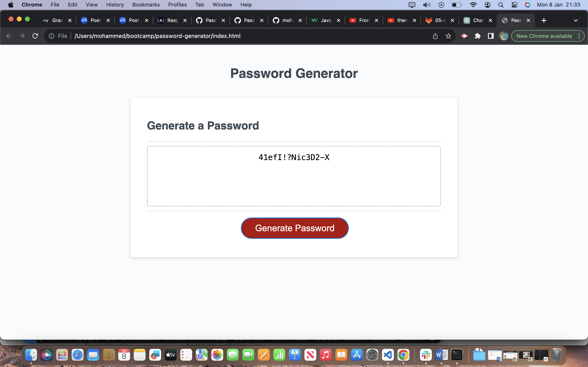

# Password Generator Challenge

## Description
In this challenge, the task was to use javascript to allow the user to generate a random passwqord between 8 and 128 characters. The task was to create a generate password button that wehn clicked, would bring up a prompt asking the user how long they would want their password to be. It also asks if they'd like lowercase or upper case letters, numbers and special charcaters included in the password. It allowed me to practice with a recently learned skill. I still find JS quite difficult and the concept of arrays is still alien to me but the more I practice and read into it, the more familiar I become. 

## Installation
To install this, go to the repository located here https://github.com/mohammed45a/password-generator. On the page, press the green code button and copy the repository using the https or ssh. Then open your terminal and go to your file/folder where you want to clone it. Write git clone on terminal then paste the link and the clone should copy to your local machine.

## Screenshot

## Usage
Webpage: https://mohammed45a.github.io/password-generator/

Repository: https://github.com/mohammed45a/passowrd-generator

## Credits

Youtube vids!

https://www.w3schools.com/js/default.asp

Starter Code provided by EdX

Stackoverflow forum for Javascript password generator - https://stackoverflow.com/questions/61239900/javascript-user-input-password-generator

## License
MIT License
